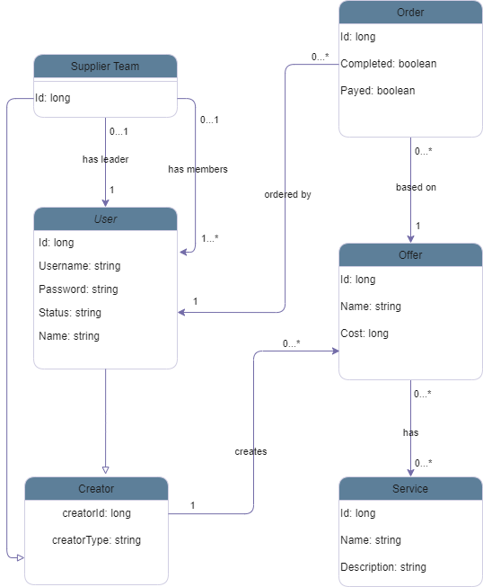

## Education: Java WEB I - SpringBoot and REST API

Cílem tohoto úkolu je vytvořit SpringBootovou aplikaci na správu nabídek.
Aplikace nemá žádný frontend, ale pouze BE a ovládá se pomocí REST rozhraní.

## Progression

- Data model created (needs review(i dnot know what im doing))
  
- Swagger created: [here](documentation/openapi3_0.yaml)
- Declared API endpoints based on Swagger
- DTOs created (if i understand what it means)
- Adding repositories...